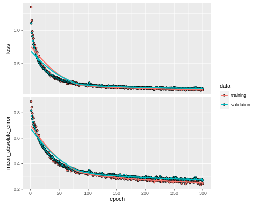

```{r setup, include=FALSE}
library(knitr)
knitr::opts_chunk$set(echo = FALSE)
knitr::opts_chunk$set(fig.cap = TRUE)
knitr::opts_chunk$set(warning = FALSE)
knitr::opts_chunk$set(message = FALSE)
knitr::opts_chunk$set(fig.pos = "!H", out.extra = "")
```

# Introduction

The use of neural networks has become more and more common over the years. Neural networks can be used in a wide range of problem areas such as classification, regression, image recognition and even playing board games such as chess. In this assignment neural networks are used for classification and regression analysis. A neural network is made up of nodes, layers and weights that connect these layers and nodes together. The typical structure of a neural network can be seen below.

{width=50%}

{width=50%}

The main difference between the two images are the output layers. If there is 5 factors in the target variable of the dataset then the neural network will output 5 values that are then fed to a softmax function. This is unlike the regression neural net that works with a continous target variable and outputs just one numeric value. The aim of any neural network of nodes and weights is to identify underlying relationships in the data set. This is done by receiving the data input and iteratively altering the weights such that it reduces a certain error function. There is a range of different loss or error functions. The main task of the loss or error functions is to calculate how accurately the network has predicted the outcome given its data. Once the network can no longer improve on the error or loss function the iterations will stop.

Neural networks have a range of hyperparameters. These hyperparameters include the number of layers of the neural network, the number of nodes per layer, the learning rate for the optimizer function, the optimizer function itself, the activation function, number of epochs, dropout percentage etc. The aforementioned hyperparameters are only those that we take into account in this assignment. There are many more hyperparameters that neural networks use. These come into play as the neural network becomes more complex. For this assignment the data sets were fairly small and simple with a reasonable number of features. Therefore, only a basic level neural network is needed.

This assignment takes into account two problems. One dataset that requires a regression analysis and the other a classification analysis. For each problem there are four models that are built. Each of these models have various hyperparameters tuned. Namely the number of layers, the number of neurons in the layer, the optimizer, the learning rate and the dropout percentage. The table below shows the different values used for hyperparameter tuning for each model (classification and regression).   

```{r tuningVals, results = "asis"}
# show table of values for each hyperparameter for each model

# for classification
class_params <- cbind(c("# Hidden layers",
                  "# input nodes",
                  "# 1st hidden layer nodes",
                  "# 2nd hidden layer nodes",
                  "# output layer nodes",
                  "optimizer",
                  "dropout percentage (1st hidden layer)",
                  "dropout percentage (2nd hidden layer)",
                  "learning rate",
                  "epochs",
                  "activation function"),
                c("1, 2",
                  "25, 50, 100",
                  "10, 25, 50",
                  "10, 25, 50",
                  "5",
                  "adam, rmsprop",
                  "0.2, 0.5",
                  "0.2, 0.5",
                  "0.01, 0.001, 0.0001",
                  "150",
                  "ReLu (hidden layers), Softmax (output layer)"))
                     
kable(class_params, caption = "Hyperparameters for Classification Neural Network")

# for regression
reg_params <- cbind(c("# Hidden layers",
                  "# input nodes",
                  "# 1st hidden layer nodes",
                  "# 2nd hidden layer nodes",
                  "# output layer nodes",
                  "optimizer",
                  "dropout percentage (1st hidden layer)",
                  "dropout percentage (2nd hidden layer)",
                  "learning rate",
                  "epochs",
                  "activation function"),
                c("1, 2",
                  "20, 30, 40",
                  "10, 15, 20",
                  "10, 15, 20",
                  "1",
                  "adam, rmsprop",
                  "0.2, 0.5",
                  "0.2, 0.5",
                  "0.01, 0.001, 0.0001",
                  "300",
                  "ReLu (hidden layers)"))
                     
kable(reg_params, caption = "Hyperparameters for Regression Neural Network")

```

The number nodes used per layer is roughly based on an article called "The Number of Hidden Layers" (Heaton, 2017). This article recommends that the number of hidden nodes be less than the number of input nodes. The number of input nodes was chosen fairly randomly. The regression model has less nodes per layer compared to the classification model because it is a smaller dataset with less variables. Adding too much nodes and layers could result in overfitting. The main focus in the tuning for this assignment was the tuning of hidden layers and number of nodes per layer. The activation functions for the hidden layers is the ReLu function and this remains unchanged throughout the tuning process. This was done based on the assumption that it is not so much the activation function that affects a neural net performance but more so its structure (Hornik, 1991). The classification problem contains a activation function called softmax in its output layer while the regression problem does not. This is because of the nature of the output of the classification problem. A vector of 5 values will be produced and softmax is used to identify which one of those values should be taken as the actual output class. Regression problems output just one numerical value and thus doesn't need the softmax output function. This is also the reason why there is 5 output nodes in the classification problem and only one output node in the regression problem. Furthermore, only two layers were used as the datasets at hand are relatively small for a neural network implementation. One or two hidden layers are normally sufficient to produce reasonable output when performed on simple datasets (Cybenko, 1989). The number of epochs also remained unchanged throughout the tuning process. This was due to difficulties in adding it to the tuning framework with the keras package.

The dropout hyperparameter may need further explanation. The dropout rate in the neural network refers to the layer before the dropout call. If the dropout rate is 0.5 it means that 50% of the nodes in the layer before the call will randomly be ignored. This is done as a regularization technique to prevent overfitting.It forces all nodes to take part and prevents over working from only certain nodes.

For the models with one hidden layer there was 54 possible hyperparameter combinations and for the model with two hidden layers there were 324 possible hyperparameter combinations. Each model was either run with all possible combinations of the hyperparameters (models with 1 hidden layer) or a subset of the hyperparameter combination space (models with 2 hidden layers). Running 324 different models proved to be too time consuming given the hardware constraints. A random 17% sample of the 324 possible hyperparameter combinations were used instead. There was not too much lost in doing this as most models performed fairly well as we will see later. However, there is a limitation that the absolute best model of the 324 possible models is likely not to be found.


# Classification Dataset

For the dataset with the factor type targets there were 22 variables and 5474 observations. There was no missing data and not much exploratory data analysis to do. However, the observations were ordered according to class and the variables used units with different scales. Thus the observations were first randomly shuffled and the feature variables scaled by subtracting the variable mean from each value and then dividing by the variable standard deviation. This scaled all variables to a value between 0 and 1. This is an essential step for neural networks to perform efficiently without any variables carrying more weight based on larger values. The dataset was then split into train and test sets in a 70/30 split (70% of the values for training and 30% for testing). The target variable was then extracted from each set to create a vector containing the train targets and the test targets. These target vectors were first one hot encoded before being used in the neural network. That is, the output value (eg 0, 1, 2, 3, 4 or 5), is converted to a vector of size 5 that is more efficiently used by the neural network for processing. 

Hyperparameter tuning was then carried out on the dataset using the hyperparameters seen in the introduction. In total 109 models were built and run using the training data. Cross validation was used for each hyperparameter combination with the validation set being 30% of the train set. Each of the 109 models were trained on 70% of the train set and validation accuracy obtained by the other 30%. Four models were obtained in the end and compared. These were the best (highest validation accuracy) one hidden layer model and the best two hidden layer model with the adam optimizer and the the best one hidden layer model and best two hidden layer model with the rmsprop optimizer.  

The hyperparameters for each of these models were extracted and run on the training data to visualise the training output as seen below. Each model was then used to make predictions on the test set and the test accuracies obtained. This can also be seen below.


```{r classTestAcc, results='asis'}
class_test_accs <- data.frame(accs = c(0.990, 0.991, 0.992, 0.989))
rownames(class_test_accs) <- c("One hidden layer adam optimizer",
                               "Two hidden layer adam optimizer",
                               "One hidden layer rms prop optimizer",
                               "Two hidden layer rms prop optimizer")
colnames(class_test_accs) <- "Test Accuracies"
kable(class_test_accs, caption = "Test accuracies for classification analysis")
```

The number of layers, neurons per layer and optimizer seems to all work quite well in classifying the data from the given dataset. The Rms prop optimizer seems to do slightly better but this would not be enough to say that it is a better optimizer than the Adam optimizer for this dataset. Each one of those model structures will suit the data well and seems to accurately identify its underlying patterns. 

# Regression Dataset

The dataset with the continuous output variable contained 1030 observations with 9 variables. 8 feature variables and 1 target variable. Again, as with the previous dataset, there was not much exploratory data analysis to do. However, the feature variables were again scaled by subtracting the variable mean from each variable value and dividing by the standard deviation. The dataset was then split into train and test sets in a 70/30 split.

Building the neural network for a regression model is different to that of the classification model. For a regression model there is no need for a softmax activation function in the output layer, the number of output nodes is just one and the accuracy measure is different. Whereas classification models use accuracy to determine performance of the neural net, regression models use mean absolute error. Mean absolute error is calculated by taking the sum of the difference between the true value from the predicted value and dividing by n (the total number of data points). The aim is to get a mean absolute error value of as close to 0 as possible. 

The process in which the model was trained, however, is very much the same as with the classification model. Hyperparameter tuning took place on the train dataset. The structures tested were one hidden layer with adam optimizer, two hidden layer with adam optimizer, one hidden layer with rms prop optimizer and two hidden layers with rms prop optimizer. Each one of these model types were tuned using the various hyperparameters (as seen in the introduction) and the hyperparameters from the models with the lowest validation mean absolute error are used on the train set for the graphical outputs. These same hyperparameters are then used to identify the test accuracies for each model type. The graphical output of the best hyperparameters on the train set can be seen below, along with the test accuracies. 





```{r regTestAcc, results='asis'}
class_test_accs <- data.frame(accs = c(0.276, 0.376, 0.313, 0.278))
rownames(class_test_accs) <- c("One hidden layer adam optimizer",
                               "Two hidden layer adam optimizer",
                               "One hidden layer rms prop optimizer",
                               "Two hidden layer rms prop optimizer")
colnames(class_test_accs) <- "Test Mean Absolute Error"
kable(class_test_accs, caption = "Test accuracies for regression analysis")
```

Here again the regression model works fairly well. Each model structure type produces very similar results and therefore one cannot recommend a "best" method. Having said this, the model with one hidden layer and the Adam optimizer produces the best test mean absolute error.

# Discussion and Conclusion

Both the classification neural network and the regression neural network seem to work well on their respective datasets. The graphical output we see is just to identify the process of the neural network. For the classification neural net output on the train data we see how the loss decreases and the accuracy increases as the neural net continuously runs the data and changes its weights to minimise the error and maximise the loss. This loss is essentially the opposite of the accuracy. The regression neural net shows a very similar output. Only this time we see the mean absolute error decreasing with each run of the data as well as the loss function. This is what we want to see as we aim for a mean absolute value close to 0.

The plot shows how the neural net produces output closer and closer to what it should. There is a danger, however, to run the data through the neural net too much (i.e increase the epochs by too much and thus alter the weights too much) or choose hyperparameters that produce perfect results on the train set. This will lead to something known as overfitting. Overfitting happens when a model is too fine tuned to its training data such that it starts modeling the noise in the train set. Once a model has overfitted it is not practical to be used against unseen data. The aim is to choose the hyperparameters such that the model learns the underlying patterns of the data but not the noise. Below can be seen the table of the best hyperparameters used for each neural network model. These hyperparameters were responsible for the test accuracies seen earlier. It's a promising sign to see good test accuracies or test mean absolute values. This indicates that the model has learned the underlying pattern of the data well enough to apply that same process on unseen data and still predict the outcomes accurately.

```{r bestParamsTab, results='asis'}

best.params <- data.frame(optimizer = c("adam", "rmsprop"),
                          Hidden = c(1,1),
                          Input_size = c(100, 30),
                          Num_1st_hidden_layer_nodes = c(50, 10),
                          dropout_percentage_1st_hidden = c(0.2, 0.2),
                          learning_rate = c(0.001, 0.01),
                          epochs = c(150, 300))

rownames(best.params) <- c("classification model",
                           "regression model")
colnames(best.params) <- c("optimizer", "hidden", "input", "1st layer nodes",
                           "dropout", "learning rate", "epochs")

kable(best.params, caption = "Best parameters for each model")
```

The above shows the hyperparameters that performed the best for the classification neural network and the regression neural network. Both had only one hidden layer which gives some evidence that one or two hidden layers should suffice for simple datasets. 

The good performance of these neural networks in this assignment are largely due to the fact that the datasets were relatively simple. Its still a good demonstration of the power a neural network has in finding underlying patterns in a dataset. Neural networks are often used on datasets with thousands of variables and millions of observations. In this case hyperparameter tuning becomes a much more important and computationally expensive job. Further work could still be done in tuning the hyperparameters of the simple neural nets in this assignment. The number of epochs could be tuned, the activation functions in the hidden layer could be tuned and even more optimizers could be tested. This may however be a fruitless task given the results produced by a simple neural network. It's always best to create a neural network as simple as possible as this saves computation time and space. 


